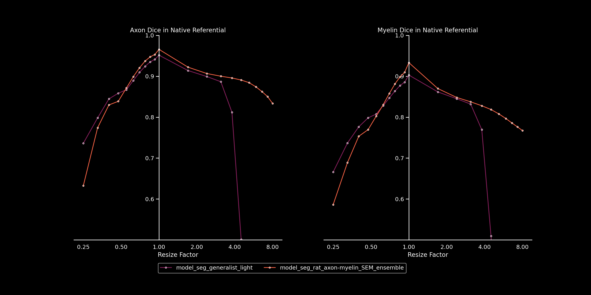

# Resolution Invariance
2 goals:
- estimate the stability of our models under resolution shifts
- explore resolution-invariant solutions

`evaluate_stability.py` applies a model on a single *IMAGE-GT* pair in a wide 
range of resolutions (the image is resized, either bigger or smaller).

The image used for this example was *sub-rat1_sample-data1_SEM.png* from the default SEM dataset.

---
To use the scripts in this repo, please use a venv with AxonDeepSeg installed. 
The only dependency to add is `monai`.